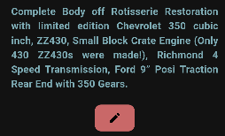

# Практическая работа №9

## Явушкин Мирослав ЭФБО-04-22

В данной работе я научился интегрировать приложение и API: 
1. ✔ была интегрирована корзина (пока только для одного пользователя) и избранные товары;
2. ✔ добавлено редактирование автомобиля в странице автомобиля: кнопка внизу с иконкой "карандаша"
   как знака для редактирования:

1. ✔ исправлена ошибка с "переходом" на сайт автомобиля, теперь кнопка находится в верхней панеле рядом
   с кнопкой "избранного" и позволяет пользователю перейти на сайт машины;

Сервер находится в следующей подпапке:

- [/server/](./server/)

В сервере произошли следующие изменения:
1. ✔ прописаны пользователи и запросы к ним; 
2. ✔ добавлена прото-версия таблицы корзины по ключам пользователей (индивидуальные корзины для пользователей); 
3. ✔ исправлена проблема, когда API вместе с обновлением данных о машине, обновлял и ID этой машины (асинхрон идентификаторов);

[Видео работы программы:](./pr9_DEMO.webm)