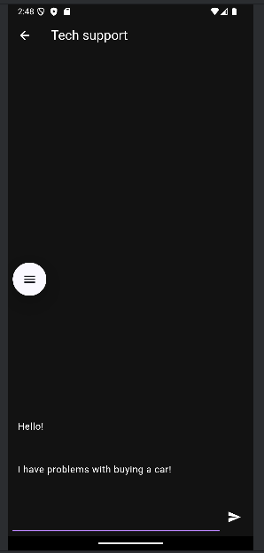

# Практическая работа №14-15

## Явушкин Мирослав ЭФБО-04-22

1. Добавлено подтверждение пароля в регистрации;
2. Добавлена система сессий авторизации (локальное хранилище);
**Для Firebase был приоритизирован Android, хоть и была попытка в iOS: к сожалению для отладки второго нет возможностей.**
3. Реализована анонимная авторизация Firebase Auth при успешной авторизации в приложении через сервис Supabase;
    - также интегрирован Firebase CLI в окружение;
4. Реализован базовый функционал чата:

5. Реализовано спец. приложение для тех. поддержки приложения, находится в папке:
[./messenger/](./messenger)
6. Дизайн готов, но демонстрация повторная со стороны тех. поддержки не прилагается (не хватает вычислительных мощностей на компьютере для двух виртуалок):

- [./server/](./server/)

[Презентация работы (программная)](./pr14_15_DEMO.webm)
[^^^ - Ссылка на Яндекс.Диск](https://disk.yandex.ru/i/sAa2tUXIGCJbWw)
[Презентация работы (визуальная)](./pr14_15_DEMO_fin.webm)
[^^^ - Ссылка на Яндекс.Диск](https://disk.yandex.ru/i/94xoDDKFwgzA8A)