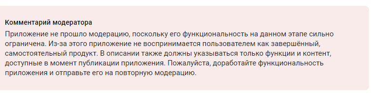

# Практическая работа №16

## Явушкин Мирослав ЭФБО-04-22

**Задание:** *попытаться* опубликовать приложение в RuStore.

1. Исправлена проблема с попыткой выхода из аккаунта;
2. Выложен сервер на Vercel (для избежания localhost);
   https://androidflutter.vercel.app/
3. Интегрирован новый сервер на Vercel в приложение;
4. Созданы материалы для публикации приложения на RuStore, отправлено на проверку:

Результаты и подробная информация и т.п. находятся в файле в папке [`/publish/`](./publish/).

Ответ модерации:
