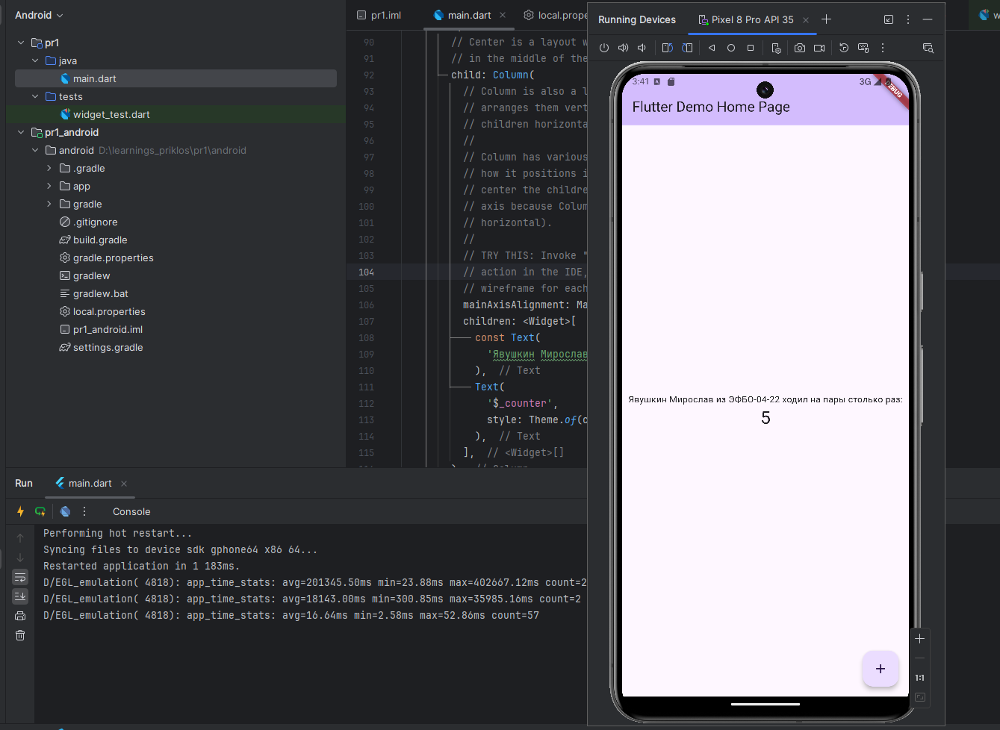
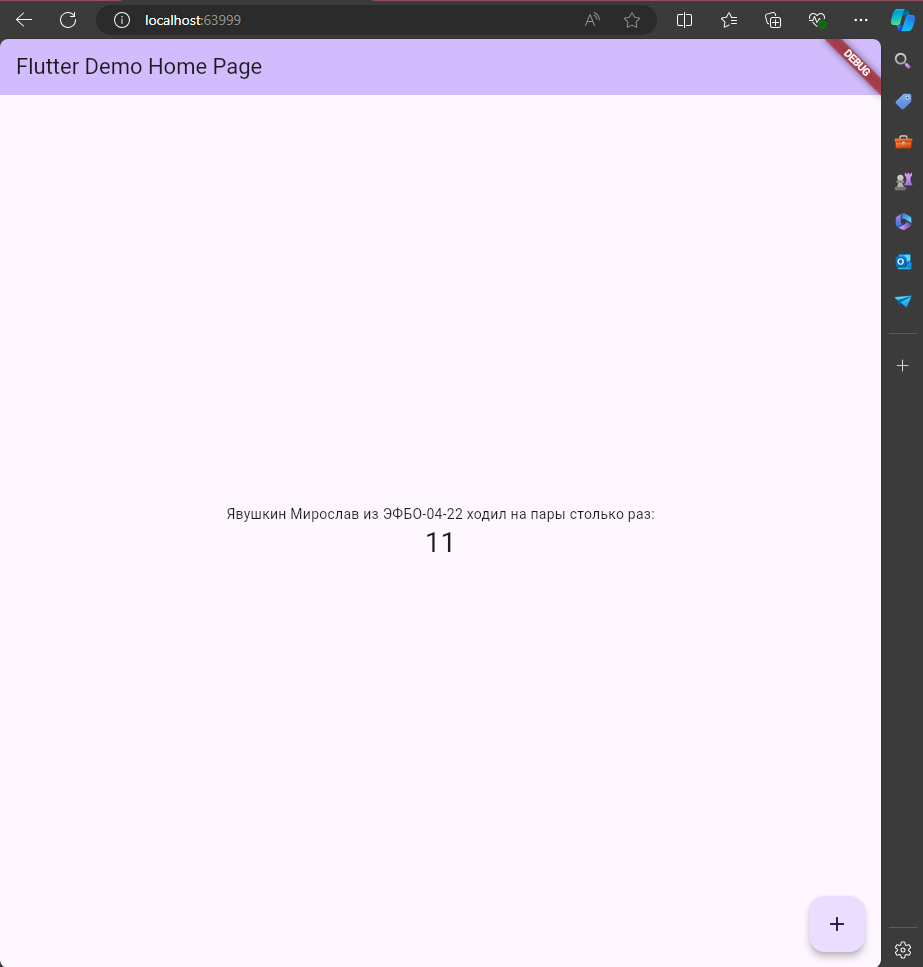

## Практическая работа №1
### Явушкин Мирослав ЭФБО-04-22
В соответствии с заданием практического занятия №1, я выбрал Android Studio в качестве IDE для разработки кроссплатформенных мобильных приложений, несмотря на проблемы, была скачана IDE, к ней были скачены плагины Dart и Flutter (т.к. плагин "не распространяется" - https://plugins.jetbrains.com/plugin/9212-flutter/versions/stable), также был скачан Flutter SDK, настроен в %PATH%;

