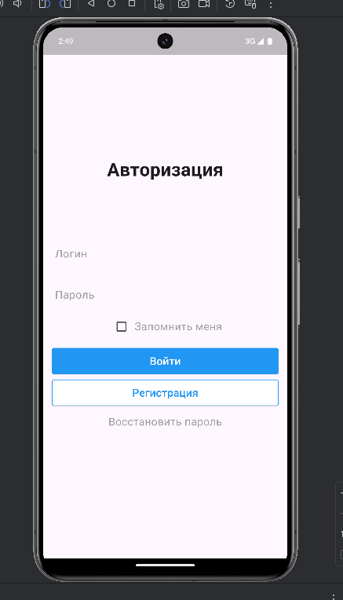
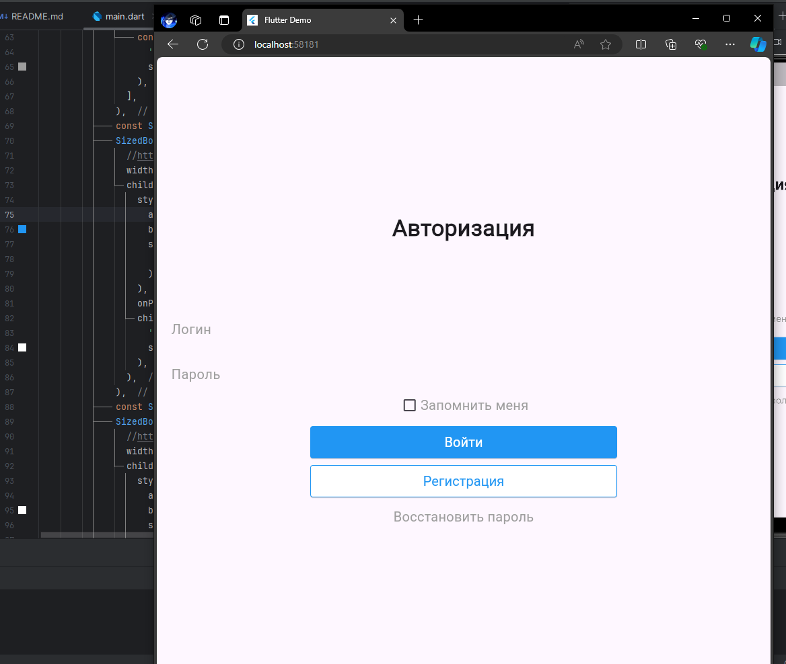

## Практическая работа №2
### Явушкин Мирослав ЭФБО-04-22
В соответствии с заданием практического занятия №2, я научился пользоваться виджетами, настраивать общую тему приложения, создавать свою домашнюю страницу при помощи StatelessWidget'а, а также играться со стилями и визуальной интерпретацией дизайна;

