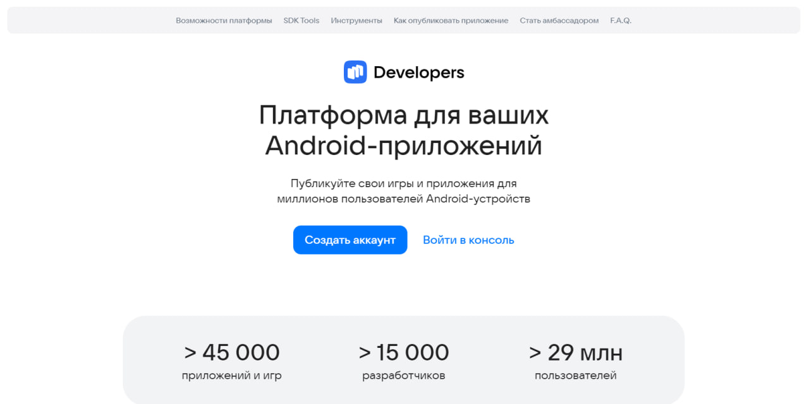
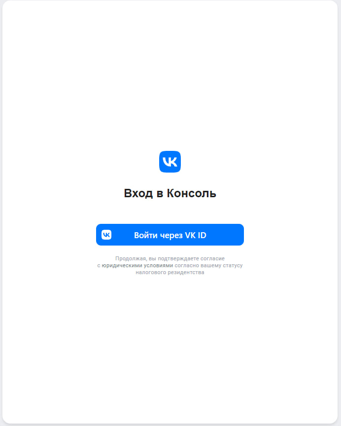
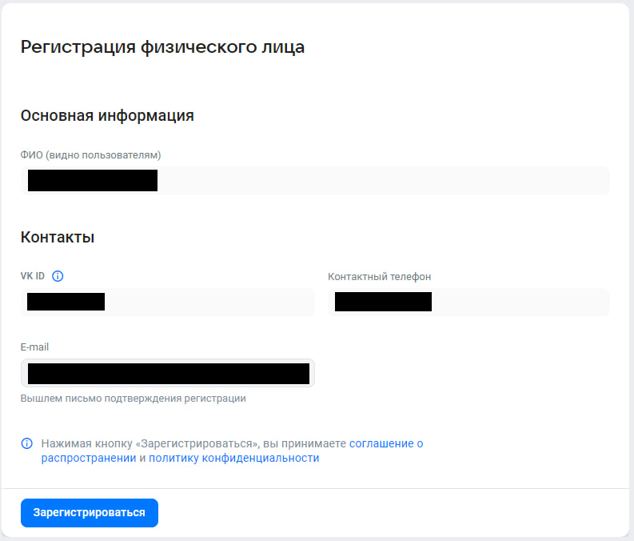

1. Я зашёл на сайт RuStore и перешёл в пункт "Разработчикам":

2. Вошёл по VK ID:

3. Зарегистрировал физ. лицо по VK ID:

4. Собрал необходимые данные и файлы для публикации, забилдил APK и отправил на проверку модерации:
